# NHSN-COVID-19-ANALYSIS

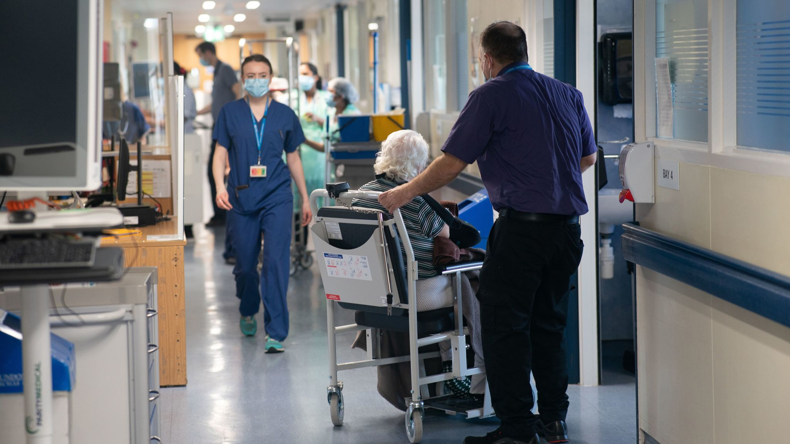

---

## Introduction

The National Healthcare Safety Network (NHSN), managed by the CDC, stands as the most extensively employed system in the United States for tracking healthcare-associated infections (HAIS). The NHSN serves as a valuable resources for healthcare facilities, public health departments, various regions, states, and the nation itself, offering essential data to pinpoint areas of concern, gauges the effectiveness of prevention measures, and ultimately work towards eradicating HAIS. In this particular project, my primary focus was on examining the impact of COVID-19 on nursing home residents and facilities, drawing insights from the NHSN dataset

---

## Problem Statement
Despite efforts to manage the impact of Covid-19 in healthcare facilities, our analysis of the NHSN dataset reveals significant variation in Covid-19 cases, deaths, and hospitalisation rates across different facilities and regions. This suggests that there may be inefficiencies or disparities in our healthcare practices. We need to further investigate the factors contributing to these variations and develop targeted strategies to improve the preparedness and response of healthcare facilities to pandemic like Covid-19

---
## Skills Demonstrated
The following SQL and Power Bi features were incorporated:

SQL: 
- Case function
- subqueries
- CTEs
- Aggregate functions.

Power Bi:
- Dax
- Calculated columns
- Page Navigation
- Modelling
- Filters
- Tooltips
- Button

---

## Data Exploration and Cleaning
I explored the four datasets with excel, where I noted data quality issues needed for cleaning and transformation:

For 2020, the original dataset contained 491,095 rows and 137 columns. The following steps breaks down the cleaning process I took in ensuring the dataset was clean, valid and ready for analysis.
- Dropped Irrelevant columns
- Converted Facility no to text Datatype
  
For 2021, the original dataset contained 793,610 rows and 137 columns.. The following steps breaks down the cleaning process I took in ensuring the dataset was clean, valid and ready for analysis.
- Dropped Irrelevant columns
- Converted Facility no to text datatype
  
For 2022, the original dataset contained 786,883 rows and 137 columns... The following steps breaks down the cleaning process I took in ensuring the dataset was clean, valid and ready for analysis.
- Dropped Irrelevant columns
- Converted Facility no to text datatype
  
For 2023, the original dataset contained 285,742 rows and 137 columns... The following steps breaks down the cleaning process I took in ensuring the dataset was clean, valid and ready for analysis.
- Dropped Irrelevant columns
- Converted Facility no to text datatype

---

## SQL-Driven Insights:

query               |             query 
:------------------:|:---------------------:
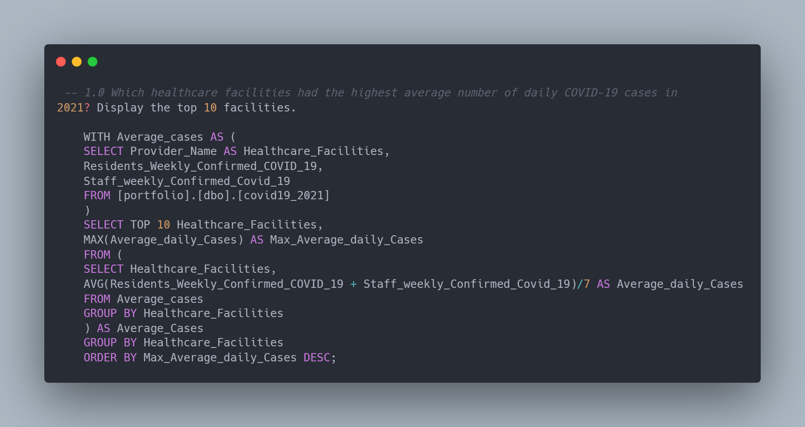    |     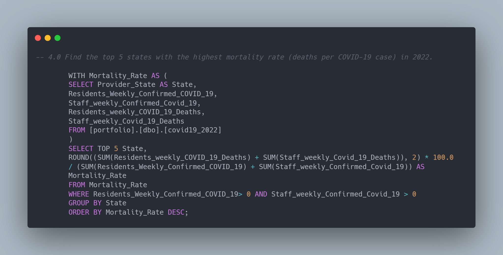      

query                          |             query 
:-----------------------------:|:-----------------------------------:
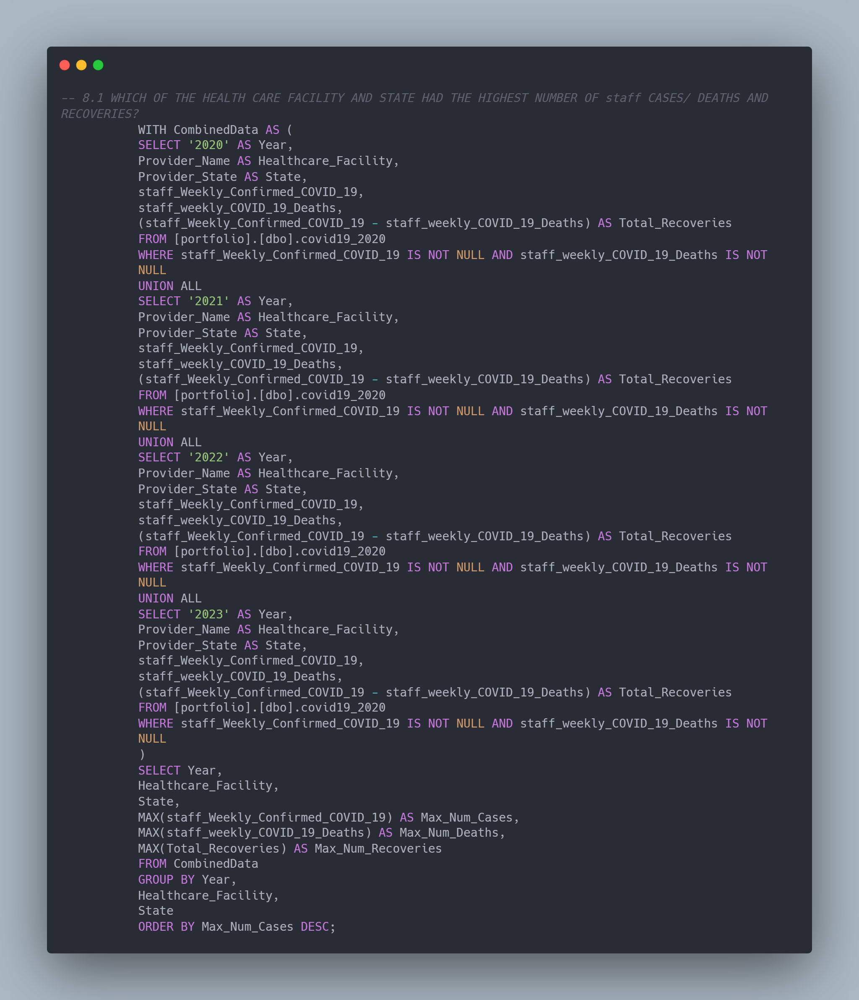             |          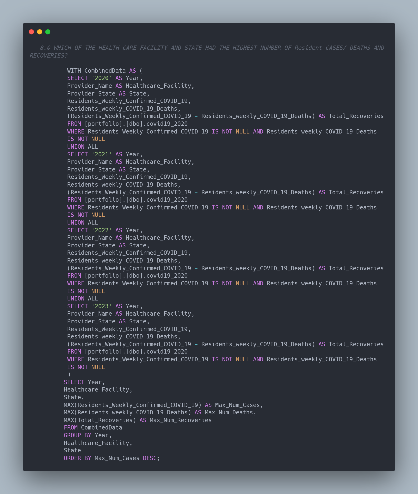                

query                          |             query 
:-----------------------------:|:-----------------------------------:
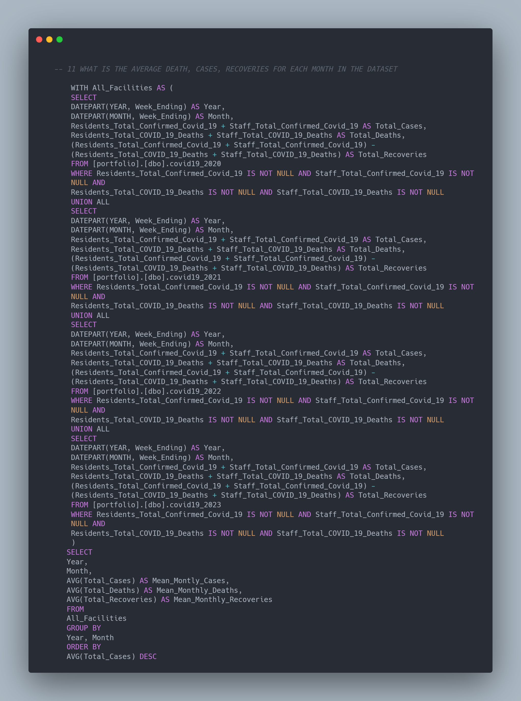               |      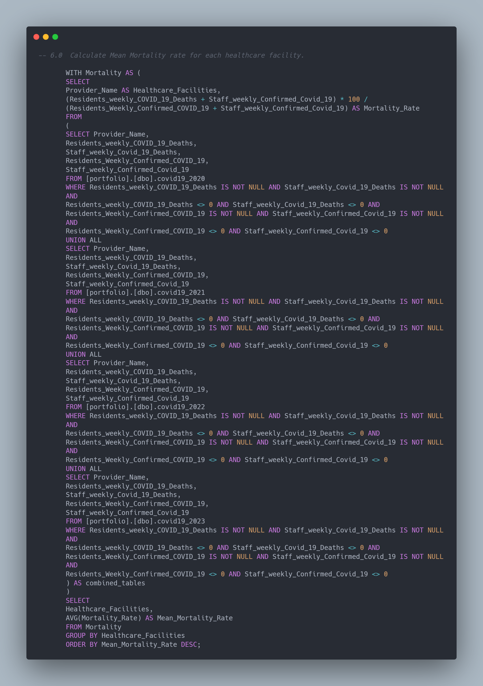

query                          |             query 
:-----------------------------:|:-----------------------------------:
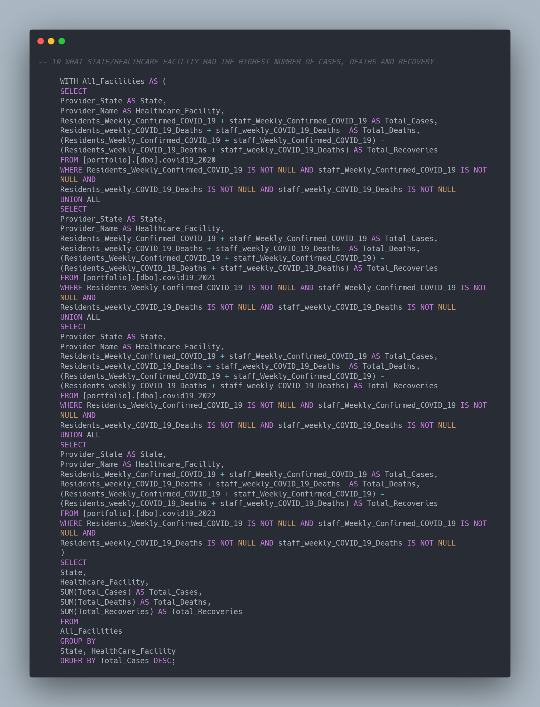             |         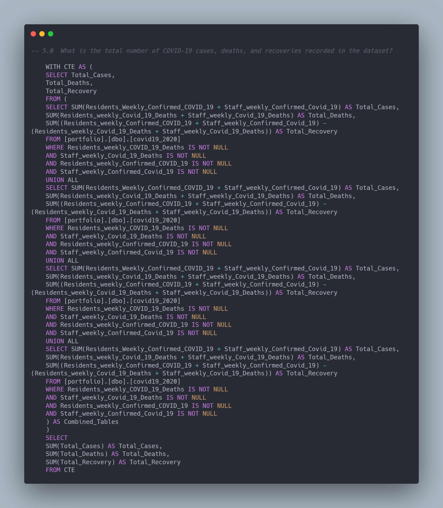

---

## Power Bi (Dax Measures created):

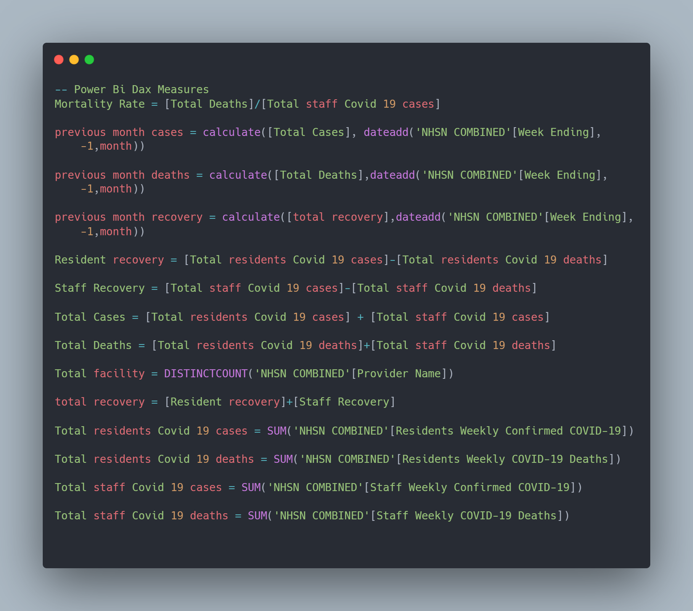

---

## Insights
1.	Between May, 2020 and May 2023, there were 3,632,695 recorded covid cases by the NHSN for nursing home residents.
2.	The total number of available facilities to handle these cases amounted to 16,000
3.	From the 3.6m covid cases, a total of 169k deaths were recorded accounting for a 10.42% of the total cases. Recovered cases amounted to 3.08m accounting for 89.58% of cases
4.	Miller's Merry Manor, Brighton Rehabilitation and wellness centre, and cedarbrook senior care and rehabilitation centre recorded the top 3 average weekly cases amongst all facilities, with 6.9, 5.4, and 5.1 average weekly cases respectively.
5.	The high average weekly cases recorded by Brighton Rehabilitation and wellness centre, and cedarbrook senior care and rehabilitation centre both are from the state of Pennsylvania, which is one of the most populous states in the United states. Population density in this state is clearly a factor in the high average weekly cases recorded in these facilities. Miller's Merry Manor on the other hand is a facility in Indiana which is the 17th most populous state. Other factors like the demography of residents must have contributed to the high average weekly cases.
6.	Texas, California, and New York recorded the highest cases across all states overtime. This is expected as they are one of the most densely populated states in the US. Dense population within these states is a major factor that contributed to high recorded covid-19 cases. New York, and California are also home to major international airports and are popular destinations for both domestic and international travellers.
7.	Furthermore, in our dataset, Texas boasted the highest count of healthcare facilities, totalling 1233, followed closely by California with 1189 healthcare facilities. Ohio secured the third position with a recorded count of 972 healthcare facilities.
8.	The top 5 states with the highest mortality rates were as follows: New Jersery, recording a mortality rate of 16%, Connecticut, with a mortality rate of 14.5%, Pennsylvania, reporting a mortality rate of 13.83%, Rhode Island 13.45% and Indiana, documenting a mortality rate of 13.01%
9.	Additionally, it’s worth noting that these high mortality rates could be attributed to the relatively low number of healthcare facilities in these states. For example: New Jersey had over 75k total cases and only 363 healthcare facilities, Connecticut had over 52k cases and 213 healthcare facilities, Rhode Island had 20k cases and 81 healthcare facilities.
10.	Over time, a varying levels of COVID-19 cases was observed from mid-2020 to May 2023. Notably, there were certain outliers, with the most prominent one occurring in January 2022, marked by a sharp and significant increase. During this period, a staggering total of more than 485,000 covid-19 cases were reported across all healthcare facilities. This marked the highest monthly caseload recorded since the onset of the pandemic, representing an astounding increase of over 700%.
11.	There is a positive correlation between Total Cases and Total Recoveries, indicating that an increase in cases, resulted to an increase in recovery rate, implying that the nursing homes had resources to handle and curb covid-19 cases through massive efficient vaccinations.

---

## Recommendations

1.	Enhance Healthcare Facility Preparedness: Given the substantial number of COVID-19 cases recorded among the nursing home residents, it is essential to ensure that healthcare facilities are adequately equipped to handle such crises. This includes having sufficient staff, personal protective equipment (PPE), and healthcare resources readily available.
2.	Strengthen Infection Control Measures: in light of the high number of cases and deaths, it is imperative to bolster infection control protocols within healthcare facilities. Regular training and strict adherence to guidelines can help minimize the spread of the virus.
3.	Increase Healthcare Facility Capacity: with a relatively low number of healthcare facility in some part of the state which may have resulted in high mortality rate, there is need to consider expanding healthcare facilities, particularly in states with high population densities. This can help provide better care to residents and mitigate the impact of future outbreaks.
4.	Focus on High-Risk States: states with high mortality rates and limited healthcare facilities should be a priority for targeted interventions. Allocating additional resources and support these areas can help reduce mortality rates.
5.	Enhance Vaccination Efforts: the positive correlation between total cases and total recoveries suggests that vaccination efforts have been effective. 
Continue to prioritise vaccination campaigns among nursing home residents and staff to further reduce the impact of Covid-19
6.	Improve Data Tracking: to better respond to outbreaks and identify trends, enhance data collection and analysis capabilities. Timely and accurate data can guide decision-making and resource allocation.
7.	Interstate Collaboration: high case numbers in densely populated states like California, Texas, and New York may require interstate collaboration and resource sharing to effectively manage outbreaks, especially in regions with high mobility.
8.	Strengthen Travel and Entry Protocols: in light of the higher COVID-19 case numbers observed in densely populated areas, it is advisable to reinforce travel and entry protocols. This includes implementing stringent measures to reduce the risk of virus transmission from external sources.
9.	Emergency Response Planning: develop and regularly update emergency response plans to be better prepared for future pandemics or outbreaks. Ensure coordination between healthcare facilities, local governments, and state agencies.

---

## Visualisation:
The report comprise of just a single dashboard
- You can interact with the report [here](https://app.powerbi.com/links/rwiLVwvtZ_?ctid=e757cfdd-1f35-4457-af8f-7c9c6b1437e3&pbi_source=linkShare)

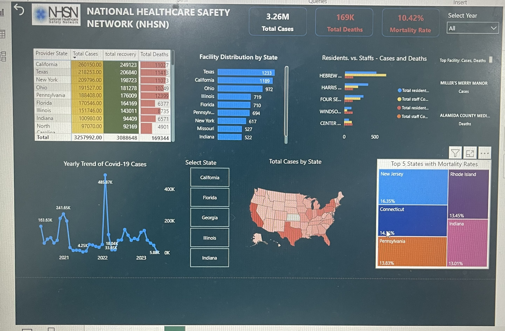

